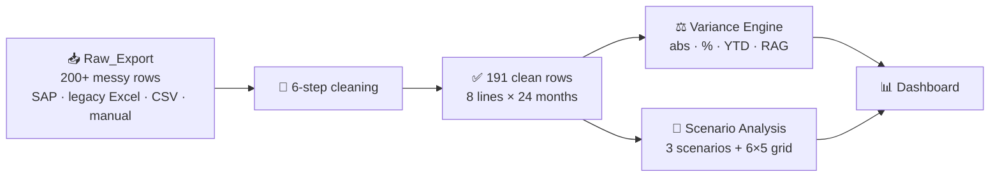

# 🏭 Corporate Budget Variance & Stress Test — How Much Pain Can the P&L Take?


> **⚡ 30-second version**
> - 🎯 **Question:** which lines are driving budget deviation, and how much shock can the P&L absorb before it breaks?
> - 📉 **FY24:** actual Net P&L **₹662L** against a **₹765L** budget.
> - 🔴 **Two culprits:** Product B ran ~13% below budget (worsening every quarter), and Operations costs ran ~7% over (accelerating).
> - 🟢 **One bright spot:** Services is the only line consistently beating budget.
> - 🧪 **Stress test:** a severe shock (−12% revenue, +8% cost) cuts Net P&L by **64%** to ₹276L. Even the worst of 30 tested scenarios stays positive at **₹114L**.

> **Data provenance:** simulated dataset. All figures are outcomes of the analysis, not client results.

---

## 🗺️ How the model flows



---

## 🧹 The mess I started with

Raw extracts from four kinds of source (SAP dumps, legacy Excel, manual uploads, CSV imports), and none of them agreed:

| | Problem | Real examples from the raw sheet |
|---|---|---|
| 📅 | Inconsistent dates | `Jan-23`, `February 2024`, `2024-01`, `Mar/24`, `3/1/2024`, `SEP-22` |
| 🗓️ | Broken FY / quarter labels | `FY24`, `23`, `Financial Year 24`, `N/A`, blank, `q4`, `Quarter 2`, `Qtr 3`, `2` |
| 🔤 | Category spelling chaos | `Cost` / `Costs` / `Cst` / `Exp` / `Expenses` / `Revnue` / `Rev` / `Income` / `Sales Revenue` |
| 🏷️ | Line-item name variants | `Product A` / `product a` / `Prod. A` / `A Product`; `Marketting` / `Mkt` / `Brand`; `HR` / `People` / `Human Resources` |
| 💱 | Mixed units and formats | `Rs. 78.75`, `21.56 lakhs`, `1.1250e+02`, `43,2`, `6160000`, `TBD`, blanks, negatives |
| 🗑️ | Structural noise | Duplicate rows, grand-total and balance-check rows, "verify this / old value / reconcile / duplicate?" notes |

## 🧼 How I cleaned it

1. 📅 **Dates:** every variant parsed to one `Mon-YY` label; fiscal years mapped to `FY23` / `FY24`; quarters normalised to `Q1`–`Q4`.
2. 🔤 **Categories:** every spelling collapsed to exactly two values, `Revenue` or `Cost`.
3. 🏷️ **Line items:** ~30 name variants reduced to 8 business lines: `Product A`, `Product B`, `Services`, `Operations`, `Sales`, `Marketing`, `HR`, `Finance & Admin`.
4. 💱 **Units:** everything converted to ₹ Lakhs. Currency text stripped, scientific notation and European decimals fixed, blanks and `TBD` treated as missing.
5. 👯 **Duplicates and junk rows:** exact and near-duplicates removed, total and check rows dropped, one row per Month × Line Item enforced.
6. 📝 **Audit trail:** the original assumption notes kept against every surviving row.

**Result:** 191 clean rows. The design target was 192 (8 lines × 24 months); the one missing combination is **HR, Jul-22**.

---

## ⚙️ What I built

| | Component | What it does |
|---|---|---|
| ⚖️ | **Variance Engine** | Absolute, % and YTD cumulative variance with RAG status on every row. Adverse means *below* budget for revenue and *above* budget for cost. |
| 🎛️ | **Scenario model** | Two live input cells (Revenue Stress %, Cost Overrun %) drive every stressed P&L figure downstream |
| 🧪 | **Named scenarios** | Base, Moderate (−5% / +3%) and Severe (−12% / +8%), side by side |
| 🗺️ | **Sensitivity grid** | 6 × 5 = 30 revenue-cost combinations, each mapped to a Net P&L outcome |
| 📊 | **Dashboard** | Four KPI tiles, budget vs actual by line, monthly trend, RAG summary with management actions |

Every downstream sheet reads only from the cleaned data. There are no hardcoded numbers in calculation cells; stress assumptions sit in marked yellow input cells.

---

## 🔍 What the model says

### 1️⃣ 📉 Where FY24 went off budget

| Line | FY24 vs budget | Signal |
|---|---|---|
| Product B | ~13% below on average, worsening each quarter | 🔴 |
| Operations (cost) | ~7% above on average, accelerating | 🔴 |
| Services | Consistently above budget | 🟢 |
| **Net P&L** | **₹662L actual vs ₹765L budget** | 🔴 |

Product B and Operations together explain most of the adverse variance.

### 2️⃣ 🧪 How much stress can the P&L take?

```
Net P&L under stress (₹ Lakhs)
Budget             ████████████████████  765
Moderate  −5%/+3%  ███████████████       568   (−26%)
Severe   −12%/+8%  ███████               276   (−64%)
Worst   −15%/+12%  ███                   114   (still positive)
```

The business stays profitable across all 30 tested combinations. Pushing it into loss would take shocks beyond the tested range.

<!-- Add a dashboard screenshot here:

-->

---

## 🧭 The decision

| | Action | Why |
|---|---|---|
| 🔍 | **Review Product B now** | Under budget every quarter, and getting worse |
| 🧾 | **Audit Operations procurement before FY25 budgeting** | Cost inflation is accelerating, not stabilising |
| 📈 | **Shift allocation toward Services** | The only line consistently beating budget |

---

## 🧠 Excel techniques used

- 🔢 `SUMPRODUCT` with multi-condition arrays
- 🔗 Cross-sheet formula linking across all six sheets
- 🎛️ Dynamic scenario inputs flowing through to every stressed figure
- 🚦 Conditional RAG logic that treats revenue and cost lines differently
- 🎨 Modelling colour conventions: blue inputs, black formulas, green cross-sheet links

## 📁 Workbook map

```
Corporate_Variance_Model.xlsx
├── Raw_Export          📥 original messy multi-source extract (untouched)
├── Raw_Export_Clean    🧹 intermediate cleaned panel
├── Raw_Export_Cleaned  ✅ final 191-row dataset (Month × Line Item)
├── Variance Engine     ⚖️ abs / % / YTD variance + RAG status
├── Scenario Analysis   🧪 live stress inputs, named scenarios, 6×5 grid
└── Dashboard           📊 KPI tiles, charts, RAG summary, actions
```

📥 [Corporate_Variance_Model.xlsx]

---

<details>
<summary>🚧 <b>Limitations</b> (click to expand)</summary>

- **Simulated data:** no real company's books were used. Findings demonstrate the method; they are not audited results.
- **Uniform shocks:** each stress applies the same % to every line. Real shocks hit lines unevenly; the model doesn't weight by elasticity.
- **Two stress levers only:** working capital, interest, tax and FX are held constant.
- **P&L, not cash flow:** a profitable stressed P&L doesn't prove the business could fund the period.
- **One missing row:** HR, Jul-22 is absent, so FY23 holds 95 rows against FY24's 96.
- **Flags, not causes:** the engine shows where variance sits, not why. Explaining Product B and Operations needs price / volume / mix data the source doesn't carry.

</details>

---

*Part of Rahul Bhagat's Data Analytics Portfolio · [🌐 Portfolio](https://rahulbhagat29.github.io/) · [💼 LinkedIn](https://www.linkedin.com/in/rahulbhagat29) · [🐙 GitHub](https://github.com/rahulbhagat29)*
